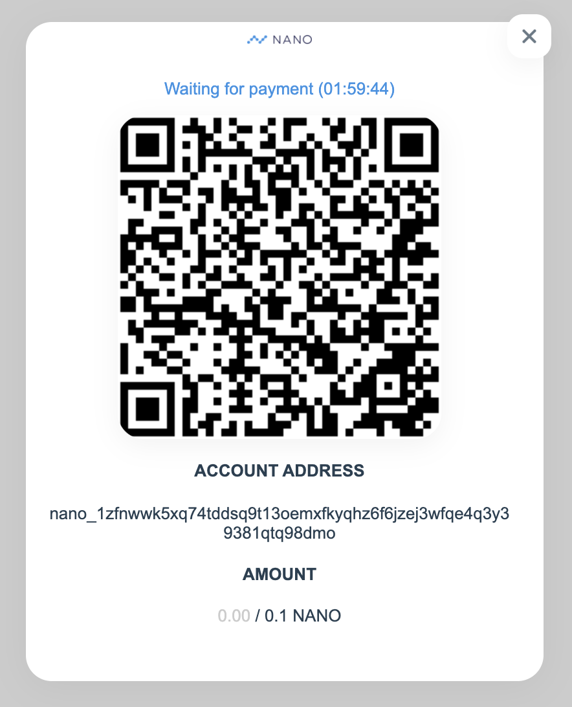

# vue-nano

QR code reader for nano crypto



### Installation

```
npm i vue-nano
```

### Usage

```vue
<vue-nano
  v-model="active"
  address="nano_1zfnwwk5xq74tddsq9t13oemxfkyqhz6f6jzej3wfqe4q3y39381qtq98dmo"
  :amount="0.1"
  :received="received"
/>
```

`active` will toggle the reader on/off, while `received` is the amount of nano your server has received.
